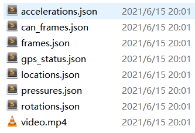
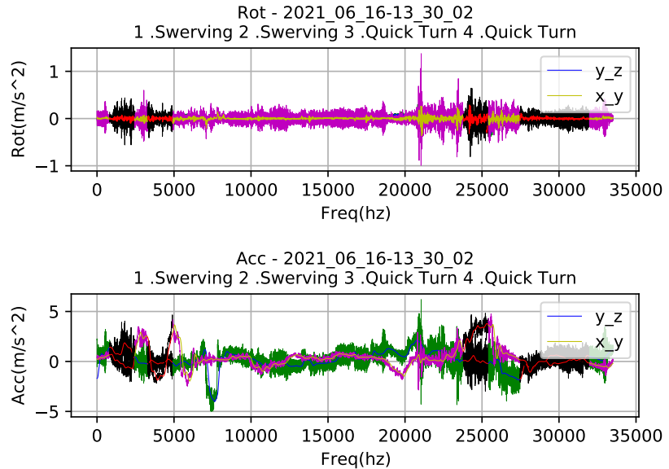

# FD-Driveset: A dataset for abnormal driving behavior Identification

# Description

This data collected via IMU of smartphones, which can be used for driving behavior Identification. The raw data is in json data format, , as shown in the figure below:

This repository provides part of pre-processed dataset, which are processed into csv format, each csv is a segment of driving behavior data, including the fields `time_usec, acc_x, acc_y, acc_z, rot_x, rot_y, rot_z, label, type`, where the `label` and `type` are data annotations.

# Visualization

To provide a direct understanding of the data, we have also provided visualization files of the data, which can be found in the folder `pdf`. 

More information will be updated later.

